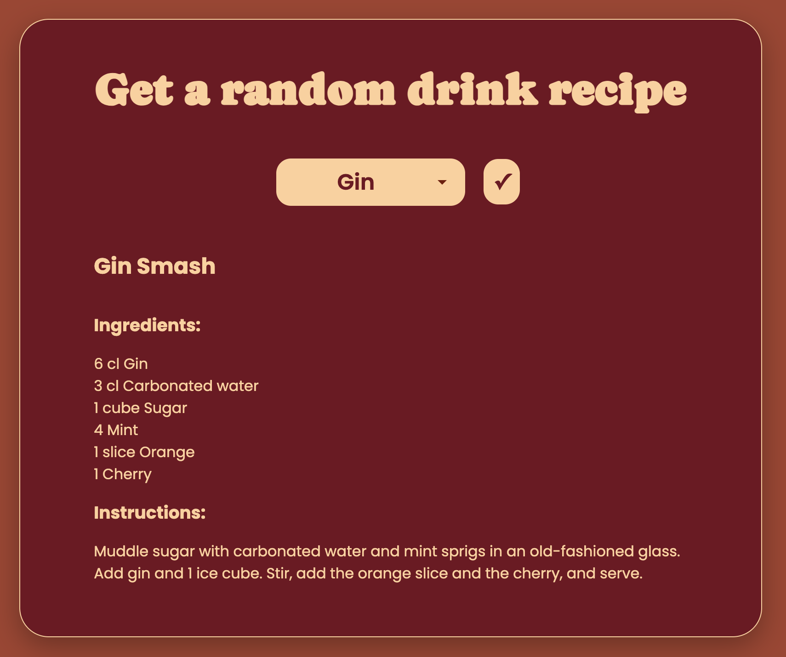
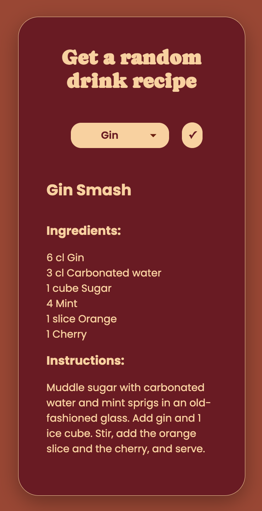

# Drink Recipe Finder

**Live site:** https://hannajohansson01.se/Drink-Recipe-Finder/

## About the project

A responsive web app that fetches random cocktail recipes from [TheCocktailDB API](https://www.thecocktaildb.com/api.php).

## Features

- Filter drinks by alcohol type via dropdown
- Fetches a random recipe from the filtered results
- Displays ingredients with measurements converted to cl
- Responsive design that works on all screen sizes

## Technologies

- Vanilla JavaScript (async/await, DOM manipulation)
- CSS custom properties and media queries
- TheCocktailDB public API

## Screenshots

<table>
  <tr>
    <td></td>
    <td></td>
  </tr>
</table>